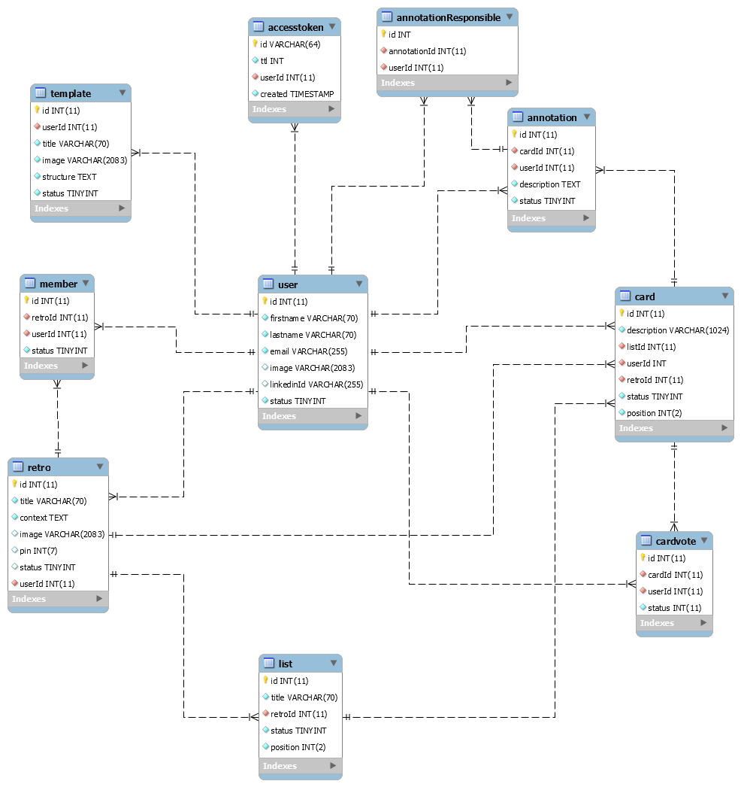

<h1 align="center">
  Retrospective - API
</h1>

<h4 align="center">
  A tool that helps to perform the Retrospective of Sprints, organizing and bringing better results.
</h4>

    
    
    
    

---

## Versioning

We use [SemVer](http://semver.org/) for versioning. For the versions available, see the [tags on this repository](https://github.com/pheliperocha/retro).

We also use [Conventional Commits](http://conventionalcommits.org/) and [Standard Version](https://github.com/conventional-changelog/standard-version), to automatic versioning and [CHANGELOG](CHANGELOG.md) generation

## NPM Commands

|Command|Description|
|-------:|--------|
| npm start | Serve API with express DEBUG and Nodemon to live-reload on changes. |
| npm run lint | Execute a lint using eslint. |
| npm run release | Run Standard-Version CLI to make the changelog and bump version. |

## ERD

The ERD are built using [MySQL Workbench 8.0](https://dev.mysql.com/downloads/workbench/). The files can be found at `/docs` directory.

## License

This project is licensed under the MIT License - see the [LICENSE.md](LICENSE.md) file for details

---

    Website <a href="https://pheliperocha.com">pheliperocha.com</a> &nbsp;&middot;&nbsp;
    GitHub <a href="https://github.com/pheliperocha">@pheliperocha</a> &nbsp;&middot;&nbsp;
    Linkedin <a href="https://www.linkedin.com/in/pheliperocha/">@pheliperocha</a>

